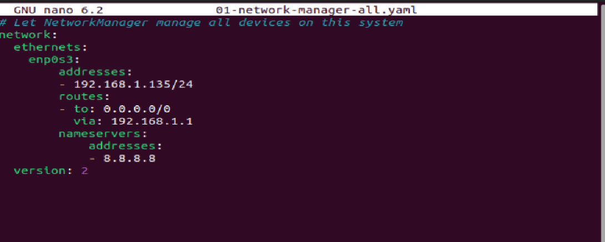
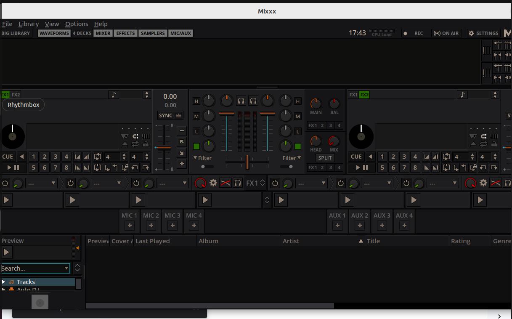
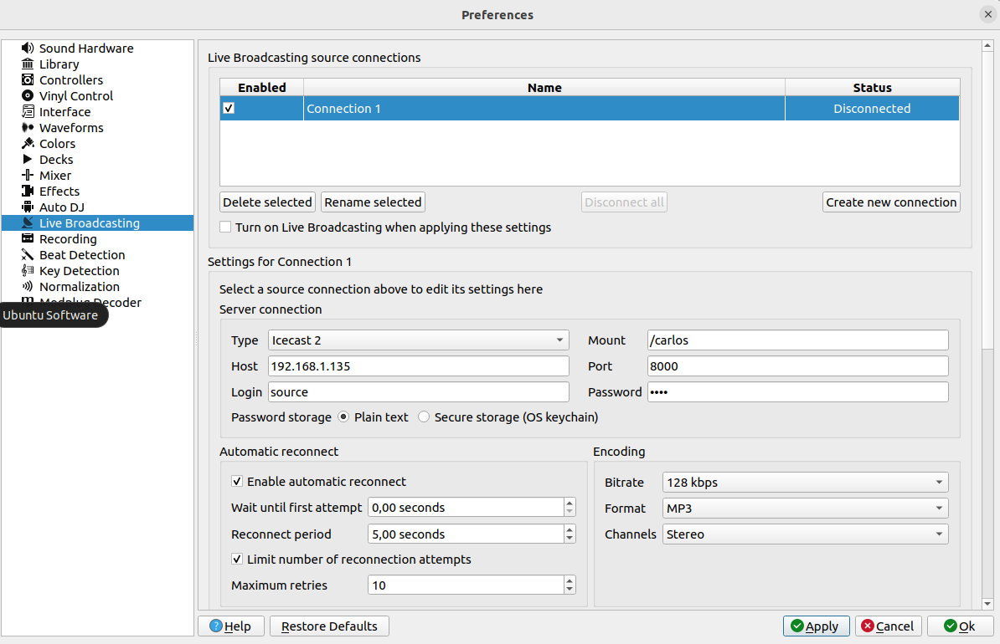
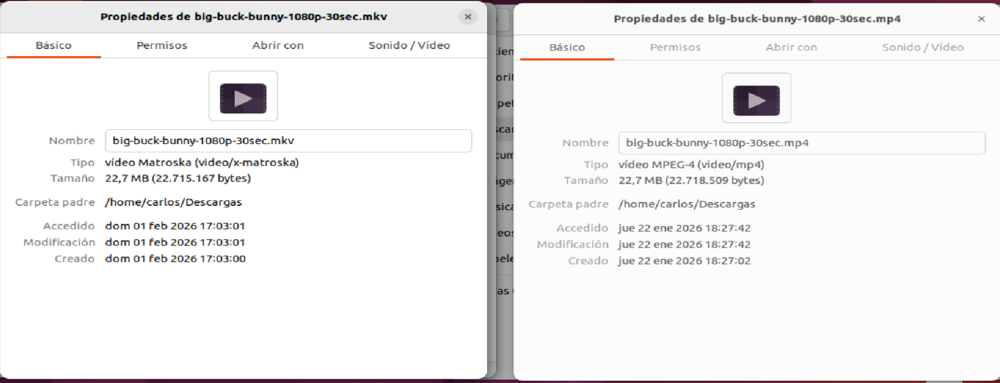
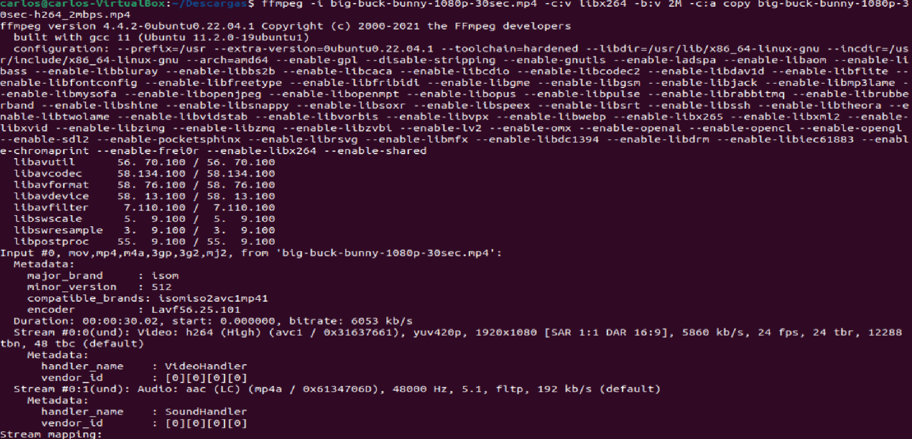
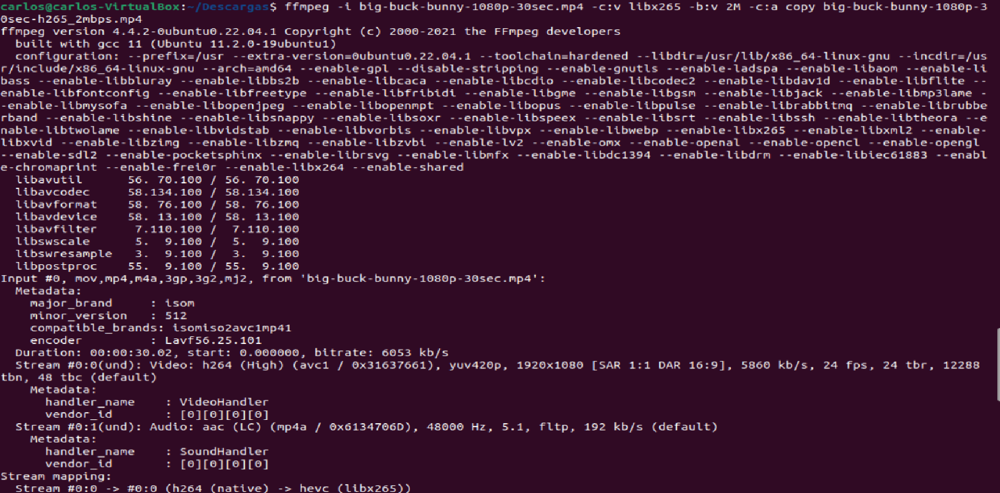
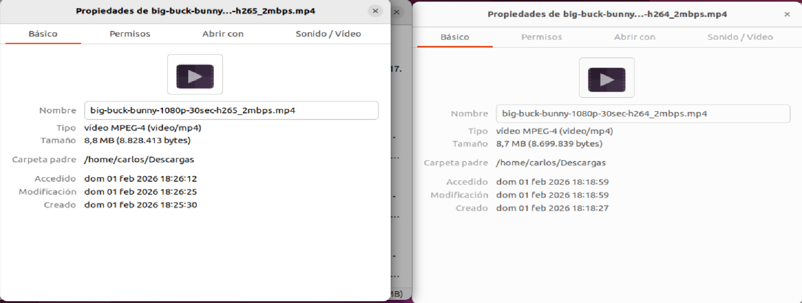

# Memoria de servicio de streaming


Carlos Durán Román

2ASIR

# Índice

- [Icecast2](#Icecast2)
  - [Introducción](#Introducción)
  - [Servidor de streaming](#Servidor-de-streaming)
  - [Cliente DJ](#Cliente-DJ)
  - [Comprobación](#Comprobación)
- [FFmpeg](#FFmpeg)
  - [Introducción](#Introducción2)
  - [Instalación FFmpeg](#Instalación-de-FFmpeg)
  - [Metadatos con FFmpeg](#Metadatos-con-FFmpeg)
  - [Cambio de contenedor](#Cambio-de-contenedor)
  - [Cambio de códecs](#Cambio-de-códecs-y-comparación)
- [Anexo](#Anexo)

# Icecast2

### Introducción

Para esta práctica vamos a utilizar icecast2, el objetivo es crear una radio online para que todos los oyentes que se conecten escuches lo que yo quiera

### Servidor-de-streaming

Vamos a configurarnos una ip fija para eso, vamos a ir a /etc/netplan y vamos a configurarnos una ip [Imágen](#netplan)

Para instalar icecast2 vamos a utilizar el siguiente comando en nuestro ubuntu

```
apt-get install icecast2
```

Al poner este comando, nos aparecerá una pantalla morada, en la primera pantalla le daremos que si, en la segunda nos saldrá que pongamos un nombre al servidor, lo dejaremos por defecto o también lo podemos cambiar, la tercera pantalla será la contraseña, eso pondremos la que queramos, nos lo pedirá 3 veces mas, una vez hecho todo esto, se instalará icecast2

### Cliente-DJ

Primero, tenemos que tenerlo configurado como adaptador puente para que se pueda ver con la máquina del servidor de streaming, luego vamos a tener que isntalarnos Mixxx con los siguientes comandos

```
add-apt-repository ppa:mixxx/mixxx
```

```
apt install mixxx
```

Una vez puesto estos comandos, se instalrá mixxx y lo podremos buscar desde el panel de aplicaciones, esta es su interfaz gráfica [Imágen](#interfaz)

Ahora, para configurar la emisión en vivo, tenemos que ir a ajustes de mixxx, a preferencias y luego a live broadcasting y poner la ip del servidor, el usuario que es source y la contraseña que hemos configurado anteriormente en la instalación de icecast2 [Imágen](#Configuración)

Una vez configurado, tan solo tendremos que darle a apply y luego a ok y en la interfaz principal, tendremos que darle a un boton que se llama on air, si está todo  configurado, ese botón se pondra en verde, para comprobar de que todo va bien, podemos volver a donde la configuración de nmixxx, donde configuramos la ip del servidor, el usuario y la contraseña y si pone connected es que está funcionando correctamente

### Comprobación

Para comprobarlo, vamos a ir a mi equipo principal y vamos a escribir lo siguiente en el navegador

```
http://192.168.1.135:8000/carlos
```

Es nuestra ip, seguido del puerto que usa icecast2 y el punto de montaje que hemos puesto antes en mixxx, ahora tan solo tendremos que reproducir la canción del cliente DJ y si esperamos 10 segundos se empezará a escuchar la canción que hayamos puesto [Imágen](#Comprobación-imágen)

# FFmpeg

### Introducción2

Para esta práctica con FFmpeg, vamos a descargarnos un video y luego vamos a ver los datos que tenemos del video descargardo, luego cambiaremos los codecs y crearemos un fichero con un bitrate determinado.

### Instalación-de-FFmpeg

Para instalar FFmpeg, vamos a utilizar el siguiente comando en nuestra máquina ubuntu

```
apt-get install ffmpeg
```

### Metadatos-con-FFmpeg

Una vez instalado, vamos a descargarnos un video y vamos a utilizar el siguinte comando para localizar la información que tiene el video descargado

```
ffprobe -v error -show_streams big-buck-bunny-1080p-30sec.mp4
```
<a name="vuelta1"></a>

Y al usar el comando nos mostrará toda la información del video [Imágen](#ffprobe) 

### Cambio-de-contenedor

Ahora vamos a cambiar el contenedor de .mp4 a .mkv con el siguiente comando

```
ffmpeg -i big-buck-bunny-1080p-30sec.mp4 -c:v copy -c:a copy big-buck-bunny-1080p-30sec.mkv
```

Aqui podemos comprobar que ha funcionado correctamente [Imágen](#Cambio-contenedor)

Podemos comprobar mediante esta imágen, que al cambiar de contenedor el video que tenemos, no ha vaariado el tamañao de este [Imágen](#Peso-imagenes)

Este comando no me ha tardado y no me ha consumido casi nada de CPU, porque este comando se encarga de copiar los datos del video MP4 y los vuelve a guardar como MKV. Como no tiene que descomprimir ni volver a comprimir, solo tiene que leer y escribir datos en el disco.

### Cambio-de-códecs-y-comparación

Primero vamos a crear un archivo en H.264 con un bitrate de 2Mbps del video anterior con el siguiente comando

```
ffmpeg -i big-buck-bunny-1080p-30sec.mp4 -c:v libx264 -b:v 2M -c:a copy big-buck-bunny-1080p-30sec-h264_2mbps.mp4
```

Con este imagen se puede comprobar que ha funcionado correctamente [Imágen](#h264.png)

Y ahora vamos a hacer lo mismo, pero con H.265

```
ffmpeg -i big-buck-bunny-1080p-30sec.mp4 -c:v libx265 -b:v 2M -c:a copy big-buck-bunny-1080p-30sec-h265_2mbps.mp4
```

Con este imagen se puede comprobar que ha funcionado correctamente [Imágen](#h265.png)

Ahora, vamos a comparar varios archivos, el video h.264 va a tirones, pero el h.265 va mucho mejor, esto es así ya que h.265 es un códec más eficiente, porque utiliza una compresión que permite aprovechar el bitrate. Como tienen la misma tasa de bits, H.265 reduce los artefactos visibles, sobretodo en las escenas con mucho movimiento, esto mantiene más detalle y una imagen más limpia.

Ahora vamos a comparar el peso de los dos archivos, podemos observar que el video H.265 pesa un poco mas que el H.264, aunque la diferencia sea muy mínima [Imágen](#Peso-codec)

### Simulacion-streaming

Low (móvil):
Resolución 240p
Bitrate: 400k
2. High (fibra):
Resolución: 1080p
Bitrate: 2Mbps


#### Pregunta 1:


**Almacenamiento: Si tu servidor tiene un disco de 500 GB, ¿cuántas horas de vídeo del perfil "HD" (2 Mbps) podrías alojar?**

-Como primero tenemos que pasar de 2Mbps a MB/s, tenemos que dividirlo entre 8, por lo tanto se nos quedaría en 0,25MB/s

**2Mbps / 8 = 0,25MB/s**

-1 hora es equivalente a 3600 segundos entonces, tenemos que hacer 0,25 MB/s x 3600 segundos y nos daria 900MB, como hay dos veces segundos, se elimina la s y equivale a 0.9GB

**0,25 MB/s × 3600 s = 900 MB, 900 MB ≈ 0,9 GB**

-Entonces, como el disco tiene de capacidad 500GB y cada hora ocupa 0,9GB del disco, habrá que dividir 500GB entre 0,9GB y nos daría aproxiamdamente 555 horas

**500 ÷ 0,9 ≈ 555 horas**

-Se podrán alojar 555 horas de vídeo en el disco de 500GB


#### Pregunta 2:


**Red: Tienes una línea de 100 Mbps simétricos. ¿Cuántos usuarios podrían ver el perfil "Móvil" (400 kbps) simultáneamente antes de saturar el 80% de la línea?**

-Como la línea tiene 100Mbps y para no saturarlo tenemos que usar el 80% de la línea, tenemos que multiplicar 100 x 0.8 que nos da 80 Mbps útiles

**100 × 0,8 = 80 Mbps útiles**

-Como cada usuario consume 400kbps, tenemos que pasarlo a Mbps porque la capacidad de línea también está en Mbps, por lo tanto, tenemos que hacer 400 kbps entre 1000 y nos da aproximadamente 0,4 Mbps por usuario

**400 kbps ÷ 1000 ≈ 0,4 Mbps por usuario**

-Ahora, como tenemos 80Mbps útiles y cada usuario consume 0,4 Mbps, tan solo tendremos que dividir 80 entre 0,4 y eso nos dará 200

**80 ÷ 0,4 = 200 usuarios**

-Entonces, 200 usuarios podrán ver el perfil móvil sin saturar la red

# Anexo

## netplan

<p align="center">
  
</p>

## interfaz

<p align="center">
  
</p>

## Configuración

<p align="center">
  
</p>

## Comprobación-imágen

<p align="center">
  
</p>

## ffprobe

<p align="center">
  
</p>

## Cambio-contenedor

<p align="center">
  
</p>

## Peso-imagenes

<p align="center">
  
</p>

## H264

<p align="center">
  
</p>

## H265

<p align="center">
  
</p>

## Peso-codec

<p align="center">
  
</p>
